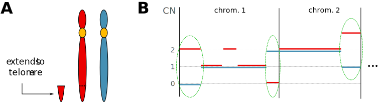

scarHRD R package Manual
========================

-   [Introduction](#introduction)
    -   [Contact](#contact)
-   [Getting started](#getting-started)
    -   [Minimum requirements](#minimum-requirements)
    -   [Installation](#installation)
    -   [Vignette](#vignette)
    -   [Citation](#citation)
-   [Workflow overview](#workflow-overview)
    -   [Input file examples](#input-file-examples)
    -   [Usage example](#usage-example)
    -   [Parameters](#parameters)
-   [Genomic scar scores](#genomic-scar-scores)
    -   [Loss of Heterozygosity (HRD-LOH)](#loss-of-heterozygosity-hrd-loh)
    -   [Large Scale Transitions (LST)](#large-scale-transitions-lst)
    -   [Number of Telomeric Allelic Imbalances](#number-of-telomeric-allelic-imbalances)
-   [References](#references)

Introduction
============

This is an adaptation to the FarkkilaB of the original package scarHRD (https://github.com/sztup/scarHRD). Some redundant lines were removed and some bugs fixed. Have fun with it!


`scarHRD` is an R package which determines the levels of homologous recombination deficiency (telomeric allelic imbalance, loss off heterozygosity, number of large-scale transitions) based on NGS (WES, WGS) data.

The first genomic scar based homologous recombination deficiency measures were produced using SNP arrays. Since this technology has been largely replaced by next generation sequencing it has become important to develop algorithms that derive the same type of genomic scar-scores from next generation sequencing (WXS, WGS) data. In order to perform this analysis, here **we introduce the `scarHRD` R package** and show that using this method the **SNP-array based and next generation sequencing based derivation of HRD scores show good correlation.**

<br>


Getting started
===============

Minimum requirements
--------------------

-   Software: R
-   Operating system: Linux, OS X, Windows
-   R version: 3.4.0
   
-   R package `devtools`:
``` r
install.packages("devtools")
```

- A modification of the `copynumber` R package:
``` r
library(devtools)
install_github('aroneklund/copynumber')
```

Installation
------------

The FarkkiLab `scarHRD` can be installed via `devtools` from github:

``` r
library(devtools)
install_github('farkkilab/scarHRD')
```


Citation
--------

Please cite allways the original scarHRD software.

<br> <br>

Workflow overview
=================

A typical workflow of determining the genomic scar scores for a tumor sample has the following steps:

1. Call allele specific copy number profile on paired normal-tumor BAM files. This step has to be executed before running scarHRD. We recommend using **Sequenza** (Favero et al. 2015) <http://www.cbs.dtu.dk/biotools/sequenza/> for copy number segmentation, Other tools (e.g. ASCAT (Van Loo et al. 2010)) may also be used in this step.  
 This step is time-consuming and compute-intensive.  
 Example for using Sequenza:  
> sequenza-utils bam2seqz -gc /reference/GRCh38.gc50Base.txt.gz --fasta /reference/GRCh38.d1.vd1.fa -n /data/normal.bam --tumor /data/tumor.bam -C chr1 chr2 chr3 chr4 chr5 chr6 chr7 chr8 chr9 chr10 chr11 chr12 chr13 chr14 chr15 chr16 chr17 chr18 chr19 chr20 chr21 chr22 chr23 chr24 chrX | sequenza-utils seqz\_binning -w 50 -s - | gzip &gt; /results/tumor\_small.seqz.gz
Further details can be found in the Vignette of Sequenza: <https://cran.r-project.org/web/packages/sequenza/vignettes/sequenza.pdf>  
2. Determine the scar scores with scarHRD R package.  
This step only takes a few minutes.  

**Note**: In the FarkkilaLab we only have used ASCAT files. Those files were proportionated by Jaana Oikkonen.

Input ASCAT file examples
-------------------
     

``` r
a<-read.table("/examples/test2.txt", header=T)
head(a)
```

    ##         SampleID Chromosome Start_position End_position total_cn A_cn B_cn
    ## 1 SamplePatient1       chr1          14574       952448        5    0    5
    ## 2 SamplePatient1       chr1         953394      1259701        3    0    3
    ## 3 SamplePatient1       chr1        1278085      4551743        2    0    2
    ## 4 SamplePatient1       chr1        4551885     14124232        2    0    2
    ## 5 SamplePatient1       chr1       14161231     31062374        3    1    2
    ## 6 SamplePatient1       chr1       31074785     47428120        4    2    2
    ##   ploidy
    ## 1    3.7
    ## 2    3.7
    ## 3    3.7
    ## 4    3.7
    ## 5    3.7
    ## 6    3.7

**Note**: To generated the above input file format from the one proporcionated by Jaana Oikkonen (segmentation.csv) I run the next lines:

```r
#Reading input and reformating
ASCAT <- read.table(file="segmentation.csv", sep="\t", quote="\"", header=T)


#Preparing input for the scarHRD
scarHRDinput <- data.frame(SampleID = ASCAT[,1],
                           Chromosome = paste("chr",ASCAT[,2],sep=""),
                           Start_position = ASCAT[,3],
                           End_position = ASCAT[,4],
                           total_cn = (ASCAT[,9] + ASCAT[,10]),
                           A_cn  = ASCAT[,9],
                           B_cn = ASCAT[,10],
                           ploidy = ASCAT[,11])
```

**Note**: Then is necessary to save the re-formated input in a plain text file.

Usage example
-------------

                         
``` r
library("scarHRD")
scar_score("F:/Documents/scarHRD/examples/test2.txt",reference = "grch38", seqz=FALSE)
```

    ## Determining HRD-LOH, LST, TAI

    ##      HRD Telomeric AI LST HRD-sum
    ## [1,]  25           35  33      93

Parameters
----------

`seg` -- input file name  
`reference` -- the reference genome used, `grch38` or `grch37` (default: `grch38`)  
`seqz` -- `TRUE` if the input file is a smallo.seqz.gz file, otherwise `FALSE` (default: `TRUE`)  
`ploidy` -- optional, previously estimated ploidy of the sample `outputdir` -- optional, the path to the output directory  

<br> <br>

Genomic scar scores
===================

Loss of Heterozygosity (HRD-LOH)
--------------------------------

The HRD-LOH score was described based on investigation in SNP-array-based copy number profiles of ovarian cancer (Abkevich et al. 2012). In this paper the authors showed that the samples with deficient BRCA1, BRCA2 have higher HRD-LOH scores compared to BRCA-intact samples, thus this measurement may be a reliable tool to estimate the sample's homologous recombination capacity.  
The definition of a sample's HRD-LOH score is the **number of 15 Mb exceeding LOH regions which do not cover the whole chromosome.**
In the first paper publishing HRD-LOH-score (Abkevich et al., 2012) the authors examine the correlation between HRD-LOH-score and HR deficiency calculated for different LOH region length cut-offs. In that paper the cut-off of 15 Mb approximately in the middle of the interval was arbitrarily selected for further analysis. The authors argue that the rational for this selection rather than selecting the cut-off with the lowest p-value is that the latter cut-off is more sensitive to statistical noise present in the data.  
In our manuscript we also investigated **if this 15 Mb cutoff is appropriate for WXS-based HRD-LOH score**.We followed the same principles as Abkievits et al, thus while there was small difference between the p-values for the different minimum length cutoff values, we chose to use the same, 15 Mb limit as Abkevich et al. We also performed Spearman rank correlation between the SNP-array-based and WXS-based HRD-LOH scores for the different cutoff minimum LOH length cutoff (manuscript, Supplementary Figure S3C). Here the 14 Mb and 15 Mb cutoff-based WXS-HRD-LOH score had the highest correlation with the SNP-based HRD score. (0.700 and 0.695 respectively). This result reassured our choice of using the 15 Mb cutoff like in the SNP-array-based HRD-LOH score.

 <br>

Large Scale Transitions (LST)
-----------------------------

The presence of Large Scale Transitions in connection with homologous recombination deficiency was first studied in basal-like breast cancer (Popova et al. 2012). Based on SNP-array derived copy number profiles BRCA1-inactivated cases had showed higher number of large scale transitions.  
A large scale transition is defined as a **chromosomal break between adjacent regions of at least 10 Mb, with a distance between them not larger than 3Mb.**

![Figure 2.A: Visual representation of the LST score on short theoretical chromosomes. Figure 2.B: Calculating LST scores from a biallelic copy-number profile; events that are marked with green "marked" signs would increase the score, while events marked with red crosses would not. The grey areas represent the centromeric regions. (From left to right; Chromosome 1: the first event passes the definition of an LST, the second bounded by a shorter than 10 Mb segment from the right, the third is bounded by a segment from the left, which extends to the centromere, the fourth’s gap is greater than 3 Mb. Chromosome 2: The first event is a valid LST, the second and third are not because they are bounded by centromeric segments, and the fourth is a valid LST)](vignettes/lst.svg) <br>

Number of Telomeric Allelic Imbalances
--------------------------------------

Allelic imbalance (AI) is the unequal contribution of parental allele sequences with or without changes in the overall copy number of the region. Our group have previously found, that the number telomeric AIs is indicative of defective DNA repair in ovarian cancer and triple-negative breast cancer, and that higher number of telomeric AI is associated with better response to cisplatin treatment (Birkbak et al. 2012).  
The number of telomeric allelic imbalances is the **number AIs that extend to the telomeric end of a chromosome.**
 <br>

References
==========

Abkevich, V., K. M. Timms, B. T. Hennessy, J. Potter, M. S. Carey, L. A. Meyer, K. Smith-McCune, et al. 2012. “Patterns of genomic loss of heterozygosity predict homologous recombination repair defects in epithelial ovarian cancer.” *Br. J. Cancer* 107 (10): 1776–82.

Birkbak, N. J., Z. C. Wang, J. Y. Kim, A. C. Eklund, Q. Li, R. Tian, C. Bowman-Colin, et al. 2012. “Telomeric allelic imbalance indicates defective DNA repair and sensitivity to DNA-damaging agents.” *Cancer Discov* 2 (4): 366–75.

Favero, F., T. Joshi, A. M. Marquard, N. J. Birkbak, M. Krzystanek, Q. Li, Z. Szallasi, and A. C. Eklund. 2015. “Sequenza: allele-specific copy number and mutation profiles from tumor sequencing data.” *Ann. Oncol.* 26 (1): 64–70.

Popova, T., E. Manie, G. Rieunier, V. Caux-Moncoutier, C. Tirapo, T. Dubois, O. Delattre, et al. 2012. “Ploidy and large-scale genomic instability consistently identify basal-like breast carcinomas with BRCA1/2 inactivation.” *Cancer Res.* 72 (21): 5454–62.

Van Loo, P., S. H. Nordgard, O. C. Lingj?rde, H. G. Russnes, I. H. Rye, W. Sun, V. J. Weigman, et al. 2010. “Allele-specific copy number analysis of tumors.” *Proc. Natl. Acad. Sci. U.S.A.* 107 (39): 16910–5.
